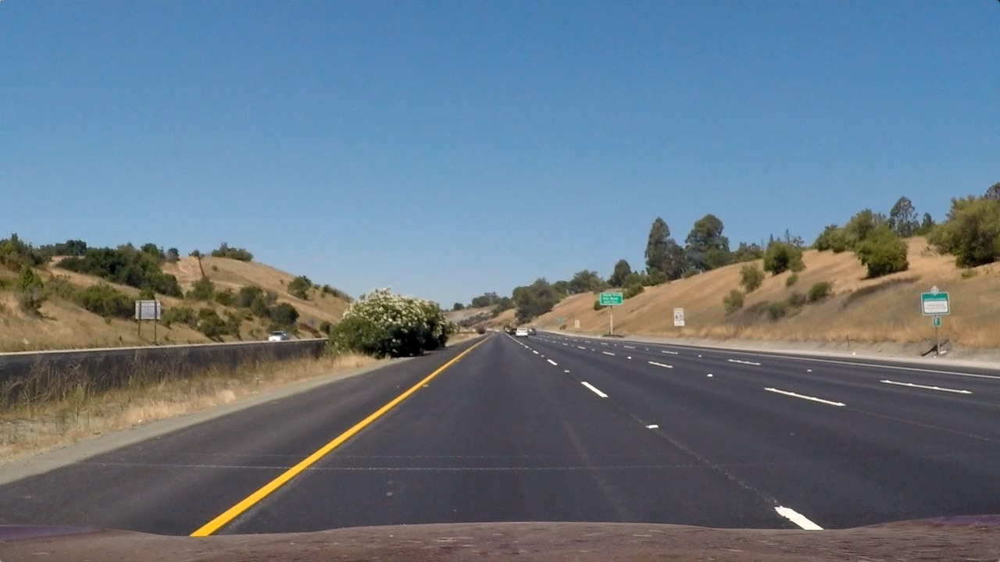
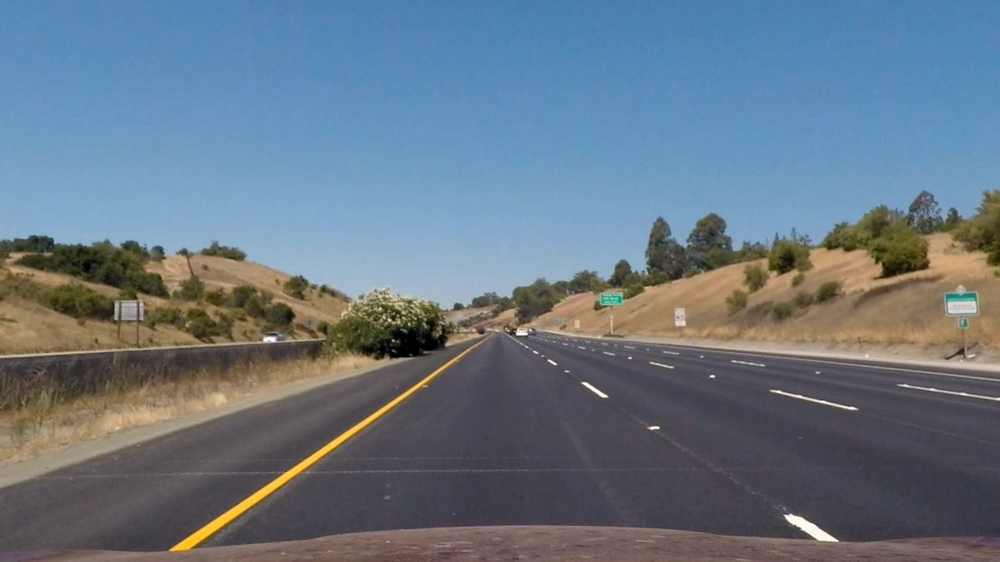
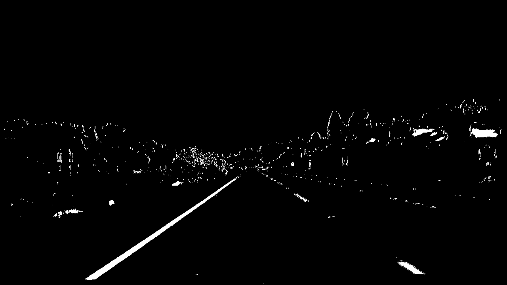
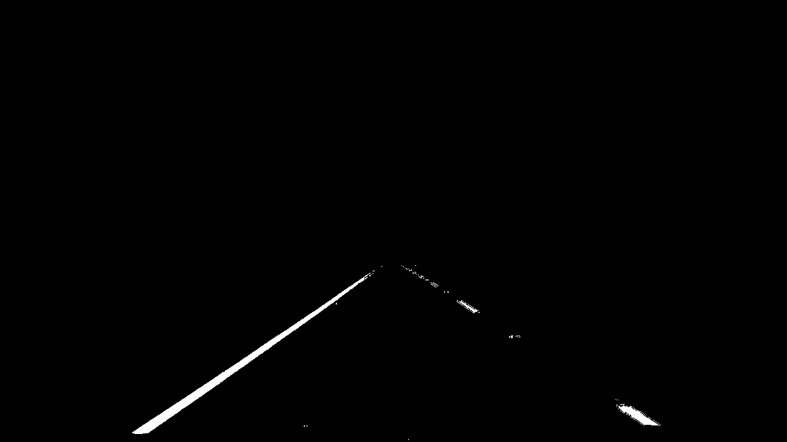
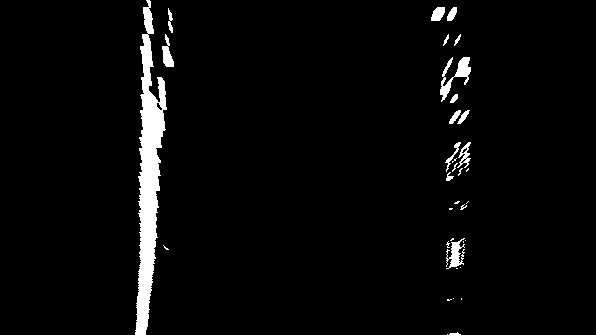
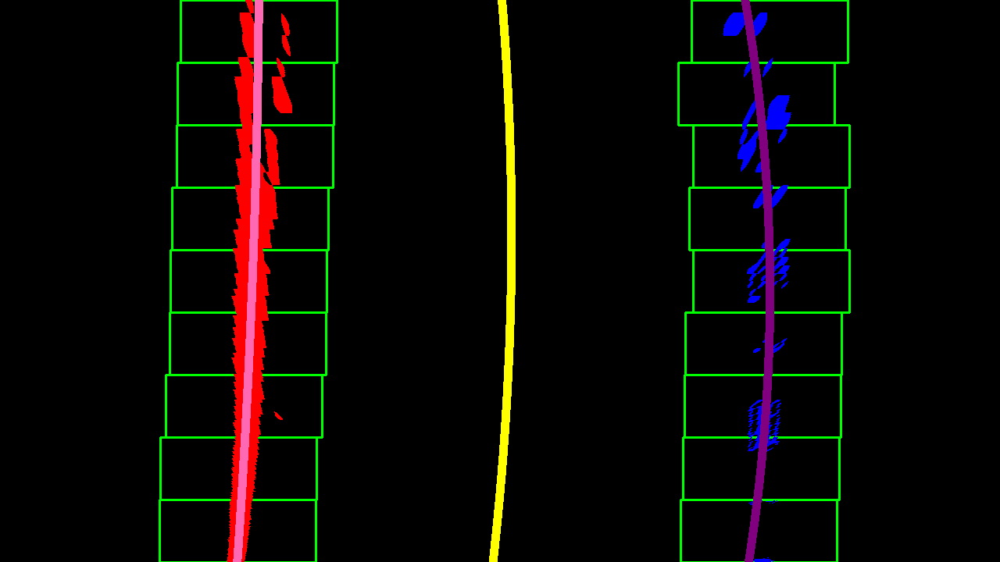
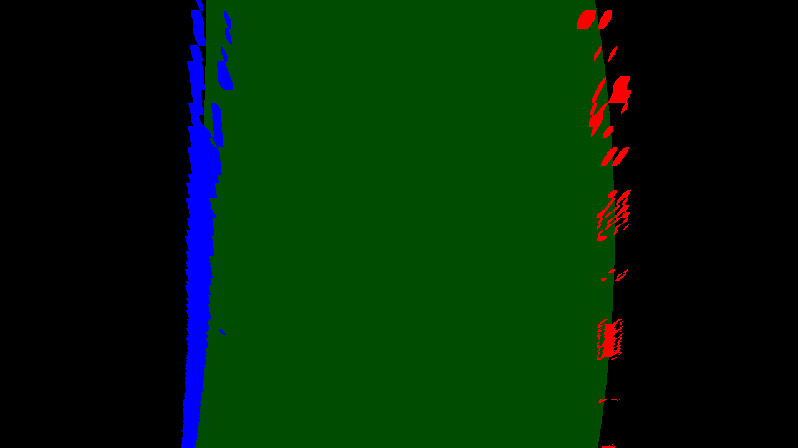
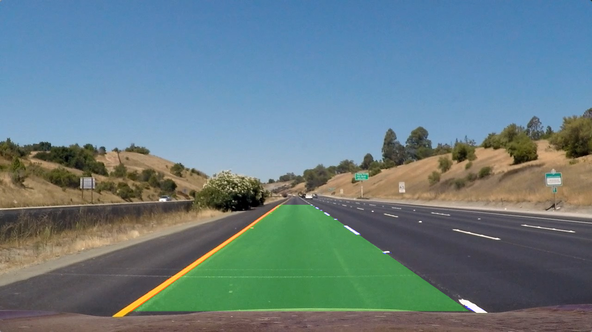

## Project 2: Advanced Lane Finding

---

**Outline of Project**

The goals / steps of this project are the following:

* Compute the camera calibration matrix and distortion coefficients given a set of chessboard images.
* Apply a distortion correction to raw images.
* Use color transforms, gradients, etc., to create a thresholded binary image.
* Apply a perspective transform to rectify binary image ("birds-eye view").
* Detect lane pixels and fit to find the lane boundary.
* Determine the curvature of the lane and vehicle position with respect to center.
* Warp the detected lane boundaries back onto the original image.
* Output visual display of the lane boundaries and numerical estimation of lane curvature and vehicle position.

The code for this project can be found in the [jupyter
notebook](https://github.com/aijose/CarND-Advanced-Lane-Lines/blob/master/P2.ipynb)
that is included in the [project
repository](https://github.com/aijose/CarND-Advanced-Lane-Lines/).

## [Rubric](https://review.udacity.com/#!/rubrics/571/view) Points

### Here I will consider the rubric points individually and describe how I addressed each point in my implementation.  

---

### Camera Calibration

#### 1. Briefly state how you computed the camera matrix and distortion coefficients. Provide an example of a distortion corrected calibration image.

The first preparatory step is to calibrate the camera to remove the effects of
distortions arising from the nature and alignment of the camera lenses. This is
typically done by taking several photographs of a chessboard on a flat surface
and detecting the corners in the chessboard using OpenCVs built in functions.
Once four key corners are identified on the image (i.e., image points) they are
used, along with the corresponding points on the object (i.e., the object
points) to calibrate the camera. The object points and image points are provided
to OpenCVs `cv2.calibrateCamera()` function. The calibration step generates the
calibration matrix which can then be used to undistort any other images taken by
the same camera. The key code snippet is provided below:

```python

ret, mtx, dist, rvecs, tvecs = cv2.calibrateCamera(objpoints, imgpoints, img_size,None,None)
dst = cv2.undistort(img, mtx, dist, None, mtx)
```

Shown below is a sample distorted and undistorted image obtained by using the
aforementioned approach:
<p align="center">


</p>
<p align="center">
<em> Distorted (left) and undistorted (right) chessboard images </em>
</p>

The code for camera calibration can be found in section **Extract Chessboard
Corners** and section **Compute Camera Calibration Matrix** of the [jupyter
notebook](https://github.com/aijose/CarND-Advanced-Lane-Lines/blob/master/P2.ipynb).
The code for performing camera calibration was obtained from Udacity's camera
calibration notebook at this
[location](https://github.com/udacity/CarND-Camera-Calibration)

### Pipeline (single images)

While describing the pipeline, images generated at each step will be provided. The results will be generated for the following image:

<p align="center">

</p>
<p align="center">
<em> Original image </em>
</p>

#### 1. Provide an example of a distortion-corrected image.

In the previous section, the camera calibration procedure was outlined. The
matrix obtained during the calibration step can be used to undistort images by
using the `cv2.undistort()` function. When distortion correction is applied to
the original image, the following undistorted image was obtained:

<p align="center">

</p>
<p align="center">
<em> Undistorted image after applying camera calibration corrections </em>
</p>

For the present work, the distorted and undistorted images do not show
significant differences. The deviations are usually in regions close to the
camera, such as the car dashboard, and do not seem to affect the most relevant
portion of the image -- the lane lines. Given the small differences between the
distorted and undistorted images the use of distortion correction may not
provide significant benefits in the context of this project.

The code snippet for performing distortion correction is provided below:
```python
undst = cv2.undistort(image, mtx, dist, None, mtx)
```

In the above code snippet, the matrix, `mtx`, was obtained in the camera
calibration step described earlier.

#### 2. Describe how (and identify where in your code) you used color transforms, gradients or other methods to create a thresholded binary image.  Provide an example of a binary image result.

In order to identify the lane lines, the edges in the image need to be
identified. The Sobel algorithm was used to identify gradients in the x
direction (since the lane lines are typically vertical). The RGB image was
converted to grayscale to perform this operation. However, using specific color
channels in the RGB (Red, Blue, Green) or HLS representation of the image    can
provide additional room for optimizing the edge detection process. In the
present work, binary images were generated for the R-channel, S-channel and
Sobel X-gradient by applying thresholds. These were used to come
up with a combined binary image that includes the important features of the
image while minimizing the less relevant features. Based on experiments
performed on the aforementioned three channels, the following key points
may be noted about the pros and cons of using each channel:

* **S channel:**

  * **Good:** It does a good job of retaining lane lines
    while being color agnostic.

  * **Bad:** It is not as effective as the Sobel X-gradient filter in capturing
    lane lines that are weak/thin. Using the S-channel alone can therefore ignore some of
    the dashed lane lines in some of the video frames.

* **Sobel Gradient:**

  * **Good:** It is very effective in capturing gradients in the image while
    ignoring regions that do not contain gradients.

  * **Bad:** Because it is good in picking up gradients, it can also pickup
    gradients that that are not necessarily lane lines (e.g, sharp lines
    on the road)

* **Red Channel:**

  * **Good:** Since red is a component in both white and yellow colors (which are
    the colors of the lanes) it can be used in combination with other filters
    to exclude regions that are not lanes while retaining edges that are lanes.

  * **Bad:** It tends to retain all regions that contain red component and does not
    identify gradients.

Setting the thresholds for the red channel, Sobel X-gradient and S-channels and
finding a way to combine them to capture relevant edges while ignoring
irrelevant details required some experimentation. In the present work the following
steps were followed to form a combined binary image of the edges:

* Three binary images were created -- Red, S-channel, Sobel X-gradient -- by
  applying suitable thresholds based on experimentation.

* The final binary image was formed by performing an AND (&) operator
  between the Red binary and the S-binary and combining the result with
  the Sobel binary using an OR (|) operator. Further discussion of some of the
  challenges faced in this process and the motivation behind the choices made
  is provided in the later part of this report.

The edge detection algorithm captures all edges. Since we are only interested
in the lane lines, we can eliminate edges associated with background and
vehicles by choosing a region of interest in the image where we expect the lane
lines to be present. This is based on the assumption that the position of the
lane lines with respect to the vehicle camera does not change much. A
quadrilateral region was selected and all edges outside this region were
blanked out. The resulting images are shown below:

<p align="center">


</p>
<p align="center">
<em> Thresholded full image (left) and masked image (right) obtained by applying color transforms and gradients </em>
</p>

The code for this section can be found in functions `edge_thresholds()` and
`region_of_interest()` in the **Helper Functions for Project 2** section of the
[jupyter
notebook](https://github.com/aijose/CarND-Advanced-Lane-Lines/blob/master/P2.ipynb)

#### 3. Describe how (and identify where in your code) you performed a perspective transform and provide an example of a transformed image.

The masked image obtained in the previous step is a view of the road when seen
from the car. Because of the angle of the camera with respect to the road, the left lane typically appears to have a positive slope while the right lane appears to have a negative slope. In order to capture lane properties such as the radius of curvature, it is necessary to have a top (birds-eye) view of the road. This can be accomplished using a perspective transform.

In order to perform a perspective transform, a quadrilateral region in the
original image is mapped onto a rectangular region in the transformed (birds-eye) image. One
way to choose four points (source points) is to take a sample image and identify
points on a lane line. We then map these points on to a rectangular
region, specified by four destination points. The relevant code for this
operation is provided below:

```python
src = np.float32([[600, 444], [675, 444], [1041, 676], [268, 676]])
offsetv = 0
offseth = 300
img_size = (image.shape[1], image.shape[0])
dst = np.float32([[offseth,             offsetv],
                  [img_size[0]-offseth, offsetv],
                  [img_size[0]-offseth, img_size[1]-offsetv],
                  [offseth,             img_size[1]-offsetv]])
```

The `warpPerspective()` function is then used to  extract the transformation
matrix and the inverse transformation matrix corresponding to this mapping.  The
top view image obtained by applying the perspective transform, is shown below:

<p align="center">

</p>
<p align="center">
<em> Top view image obtained by applying perspective transform </em>
</p>

The fact that the lane lines in the transformed image are parallel to each other gives us confidence that the transformation behaves as expected.

The code for this section can be found in function `topview()` in the
**Helper Functions for Project 2** section of the  [jupyter
notebook](https://github.com/aijose/CarND-Advanced-Lane-Lines/blob/master/P2.ipynb)

#### 4. Describe how (and identify where in your code) you identified lane-line pixels and fit their positions with a polynomial?

Once the topview is obtained, the lane lines need to be identified. To do this,
a histogram of is generated, which sums the white pixels in the y-direction for
each x-location in the image. The two peaks in the histogram may be assumed to
be close to the location of the base of the two lane lines. The lane pixels are analyzed by
using rectangular windows which are placed where we expect the lane lines to be
present. In the present work, 9 windows were stacked one on top of the other to
track the lane lines along the image.

The first window is placed at the bottom of the image with its center at the
locations corresponding to the histogram peaks. If the number of pixels in a
window exceeds a threshold (which implies that there is a legitimate segment of
the lane in the window) the average x-coordinate of white pixels in the window
is computed. The center of the next lane window is then adjusted to match the averaged
x-coordinate of its predecessor window. This ensures that the windows adjusts to
the lane location if there is significant curvature.

Once all the lane points are extracted using the stacked windows, a polynomial
is fit to the left and right lane points. Since the lane is typically vertical,
the y-location is treated as the independent variable and the x-location is
treated as the independent variable for fitting the polynomial. To compute the
radius of curvature of the lane, the middle line for the lane needs to be computed.
This was obtained by averaging the fitted x-coordinates of the left and right
lanes. The figure below shows the results obtained:

<p align="center">


</p>
<p align="center">
<em> Lane lines and lane regions plotted on top view image </em>
</p>

The fitted left, right and center lines are represented by the pink, purple
and yellow lines in the left image. The lane region is identified by the green
region in the right image.

The code for this section can be found in functions `search_around_poly()`, `find_lane_pixels()` and  `fit_poly()` in the **Helper Functions for Project 2**
section of the  [jupyter
notebook](https://github.com/aijose/CarND-Advanced-Lane-Lines/blob/master/P2.ipynb)

#### 5. Describe how (and identify where in your code) you calculated the radius of curvature of the lane and the position of the vehicle with respect to center.

The polynomial coefficients obtained in the previous step are in the image coordinates.
In order to compute the radius of curvature in the real world, the polynomial
has to be transformed from the image coordinates to the real world coordinates.
This can be accomplished by using scaling factors that scale from pixels to
meters for both x and y coordinate directions. The derivation of the
transformation equations can be found in the [jupyter
notebook](https://github.com/aijose/CarND-Advanced-Lane-Lines/blob/master/P2.ipynb)
in the section titled **Derivation of polynomial transformation from image
coordinates to real coordinates**.  Once the coefficients of the polynomial for
the center line were obtained, the radius of curvature can be computed from the
coefficients using the code snippet provided below:

```python
poly_curverad = ((1.0 + (2.0*poly_fit[0]*y_eval + poly_fit[1])**2)**1.5)/(2.0*poly_fit[0])
```

The code for this section can be found in functions `convert_to_real()` and
`measure_curvature()` in the **Helper Functions for Project 2** section of the
[jupyter
notebook](https://github.com/aijose/CarND-Advanced-Lane-Lines/blob/master/P2.ipynb)


#### 6. Provide an example image of your result plotted back down onto the road such that the lane area is identified clearly.

Once the lane regions are identified on the top view image, they are mapped
back onto a blank image that has the same dimensions as the original image using
the inverse perspective transform. The resulting image is then weighted with the
original image to obtain the final result that contains the lane region
highlighted in green. The final image is shown below:

<p align="center">

</p>
<p align="center">
<em> Lane region shaded in top view (left) and original image (right)  </em>
</p>

The code outlining all the steps in the pipeline for generating the final  image
containing the lane region highlighted in green is contained in the function
`process_single_image()` in the **Helper Functions for Project 2** section of
the [jupyter notebook](https://github.com/aijose/CarND-Advanced-Lane-Lines/blob/master/P2.ipynb)

---

### Pipeline (video)

#### 1. Provide a link to your final video output.  Your pipeline should perform reasonably well on the entire project video (wobbly lines are ok but no catastrophic failures that would cause the car to drive off the road!).

Once the procedure for processing a single image is formulated, the same
approach can be used to process a video by processing the individual images that
constitute the video. A link to the processed video is provided below:
[](https://youtu.be/MZcdxmrmI9c)

The code for processing the video can be found in the section **Create Video** section of
the [jupyter notebook](https://github.com/aijose/CarND-Advanced-Lane-Lines/blob/master/P2.ipynb)

---

### Discussion

#### 1. Briefly discuss any problems / issues you faced in your implementation of this project.  Where will your pipeline likely fail?  What could you do to make it more robust?

Outlined below are some of the issues faced while implementing this project
along with a description of how they were addressed:

* Initially the edge detection algorithm primarily used the Sobel X-gradients and
  saturation (S) channel to detect the edges. However, one of the challenges
  with using the saturation channel is that it captures shadows and dark
  regions in the lane. Edges formed by shadows and other lane irregularities
  introduced inaccuracies in the detection of lane lines. To eliminate the
  effect of shadows, the saturation threshold was combined with the red channel.
  Only edges that satisfied the saturation threshold AND the red channel
  thresholds were included. This made the algorithm more robust to shadows
  and other lane irregularities.

* Another source of inaccuracies was due to the presence of non-lane-line
  gradients on the
  road which were captured by the Sobel filter. Since these dark lines where
  close to the lane lines, they introduced errors in the calculation of the
  lane lines. To fix this, the lower Sobel threshold was increased
  sufficiently exclude the dark lines while retaining lane lines.

While the current project achieves satisfactory results, it is not without
shortcomings. Some of the shortcomings of the current approach are outlined
below, along with ideas for improving the algorithm:

* The current approach assumes that the lane shape does not have multiple peaks
  or troughs. For some winding roads, a second order polynomial may not be adequate
  to capture the shape of the lane correctly. One way to make the current algorithm
  more robust is to use cubic splines or multiple curves to accurately capture
  highly winding roads.

* If there are sharp turns in the road, the lanes will fall outside the masked
  region of interest and will not be captured.  To handle these situations it
  may be necessary to expand the region of interest to include the entire
  horizontal span of the image. This
  will require more robust techniques to distinguish between edges belonging to
  lane lines and other objects (e.g., cars) or structures (lane dividers).

* The present approach does not use information from previous video frames when
  computing the lane lines for the current video frame. Using information from
  previous frames can be used save computational effort but can also help in
  mitigate the effect of new road structures or markings that suddenly pop up
  and disrupt the accurate calculation of lane lines. This will also prove
  helpful in scenarios where the lane lines are temporarily covered by leaves
  or rendered indistinguishable due to strong lighting or other factors.
